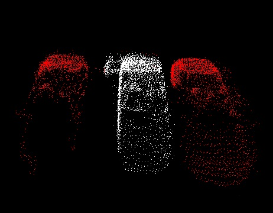

# Euclidean clustering

유클리드 유클리드

가장 간단한 방법의 군집화 방법으로 두 점사이의 거리를 계산 해서 특정 거리 이하일경우 동일한 군집으로 간주 하는 방법입니다. 이때 거리를 계산 하는 방법으로 유클리드 거리계산법을 이용하여 **Euclidean clustering** 라고 합니다. 유클리드 거리 계산법\(=L2\)은 맨하탄 거리 계산법\(=L1\)과 함께 두점의 거리\(=유사도\)를 계산 할때 많이 사용 됩니다. 전자는 그림의 보라색과 같이 같이 실질적으로 x축으로 이동 거리와 y축으로 이동 거리모두 더한것을 의미하며 후자는 그림의 보라색과 같이 우리가 일반적으로 아는 두 점사이의 직선 거리로 삼각형 변의 공식\(??\)을 이용하여 계산 합니다.


점군 계산에서 점 간 거리만 계산하고, 탐색하면 되므로, 처리속도가 다른 클러스터링 알고리즘에 비해 매우 빠르다. 다만, 세밀한 클러스터링을 할 수 없는 단점이 있다.



동작 과정은 다음과 같습니다. 

1. 효율적인 계산을 위하여 점군의 KdTree구조체를 생성 합니다. 

2. 하나의 군집으로 간주한 거리 정보를 설정 합니다. 

3. 이웃 점군을 탐색 하면서 거리 내에 있을경우 하나의 군집으로 설정 합니다.

4. 이웃 점군이 지정된 거리 내에 없을 경우 탐색 하지 않은 새 포인트를 새 군집으로 선택하고 탐색 합니다. 

입력에 사용되는 파라미터는 다음과 같습니다.

```text
  ec.setInputCloud (cloud);       // 입력   
  ec.setClusterTolerance (0.02);  // 2cm  
  ec.setMinClusterSize (100);     // 최소 포인트 수 
  ec.setMaxClusterSize (25000);   // 최대 포인트 수
  ec.setSearchMethod (tree);      // 위에서 정의한 탐색 방법 지정 
  ec.extract (cluster_indices);   // 군집화 적용
```

실행 코드는 다음과 같습니다. 

```cpp
#include <pcl/ModelCoefficients.h>
#include <pcl/point_types.h>
#include <pcl/io/pcd_io.h>
#include <pcl/filters/extract_indices.h>
#include <pcl/filters/voxel_grid.h>
#include <pcl/features/normal_3d.h>
#include <pcl/kdtree/kdtree.h>
#include <pcl/sample_consensus/method_types.h>
#include <pcl/sample_consensus/model_types.h>
#include <pcl/segmentation/sac_segmentation.h>
#include <pcl/segmentation/extract_clusters.h>

// Euclidean Cluster Extraction
// http://pointclouds.org/documentation/tutorials/cluster_extraction.php#cluster-extraction

int 
main (int argc, char** argv)
{

  pcl::PointCloud<pcl::PointXYZRGB>::Ptr cloud (new pcl::PointCloud<pcl::PointXYZRGB>);
  pcl::PointCloud<pcl::PointXYZRGB>::Ptr cloud_f (new pcl::PointCloud<pcl::PointXYZRGB>);

  // *.PCD 파일 읽기 (https://raw.githubusercontent.com/adioshun/gitBook_Tutorial_PCL/master/Intermediate/sample/RANSAC_plane_true.pcd)
  pcl::io::loadPCDFile<pcl::PointXYZRGB> ("RANSAC_plane_true.pcd", *cloud);

  // 포인트수 출력
  std::cout << "PointCloud before filtering has: " << cloud->points.size () << " data points." << std::endl; //*

  // 탐색을 위한 KdTree 오브젝트 생성 //Creating the KdTree object for the search method of the extraction
  pcl::search::KdTree<pcl::PointXYZRGB>::Ptr tree (new pcl::search::KdTree<pcl::PointXYZRGB>);
  tree->setInputCloud (cloud);  //KdTree 생성 


  std::vector<pcl::PointIndices> cluster_indices;       // 군집화된 결과물의 Index 저장, 다중 군집화 객체는 cluster_indices[0] 순으로 저장 
  // 군집화 오브젝트 생성  
  pcl::EuclideanClusterExtraction<pcl::PointXYZRGB> ec;
  ec.setInputCloud (cloud);       // 입력   
  ec.setClusterTolerance (0.02);  // 2cm  
  ec.setMinClusterSize (100);     // 최소 포인트 수 
  ec.setMaxClusterSize (25000);   // 최대 포인트 수
  ec.setSearchMethod (tree);      // 위에서 정의한 탐색 방법 지정 
  ec.extract (cluster_indices);   // 군집화 적용 

  // 클러스터별 정보 수집, 출력, 저장 
  int j = 0;
  for (std::vector<pcl::PointIndices>::const_iterator it = cluster_indices.begin (); it != cluster_indices.end (); ++it)
  {
    pcl::PointCloud<pcl::PointXYZRGB>::Ptr cloud_cluster (new pcl::PointCloud<pcl::PointXYZRGB>);
    for (std::vector<int>::const_iterator pit = it->indices.begin (); pit != it->indices.end (); ++pit)
     cloud_cluster->points.push_back (cloud->points[*pit]); 
    cloud_cluster->width = cloud_cluster->points.size ();
    cloud_cluster->height = 1;
    cloud_cluster->is_dense = true;

    // 포인트수 출력
    std::cout << "PointCloud representing the Cluster: " << cloud_cluster->points.size () << " data points." << std::endl;

    // 클러스터별 이름 생성 및 저장 
    std::stringstream ss;
    ss << "cloud_cluster_" << j << ".pcd";
    pcl::PCDWriter writer;
    writer.write<pcl::PointXYZRGB> (ss.str (), *cloud_cluster, false); //*
    j++;
  }

  return (0);
}
```

#### Conditional Euclidean Clustering

좀더 세밀한 군집화를 위하여 거리 정보외에 사용자가 지정한 조건을 고려 하게 할수도 있습니다. 


